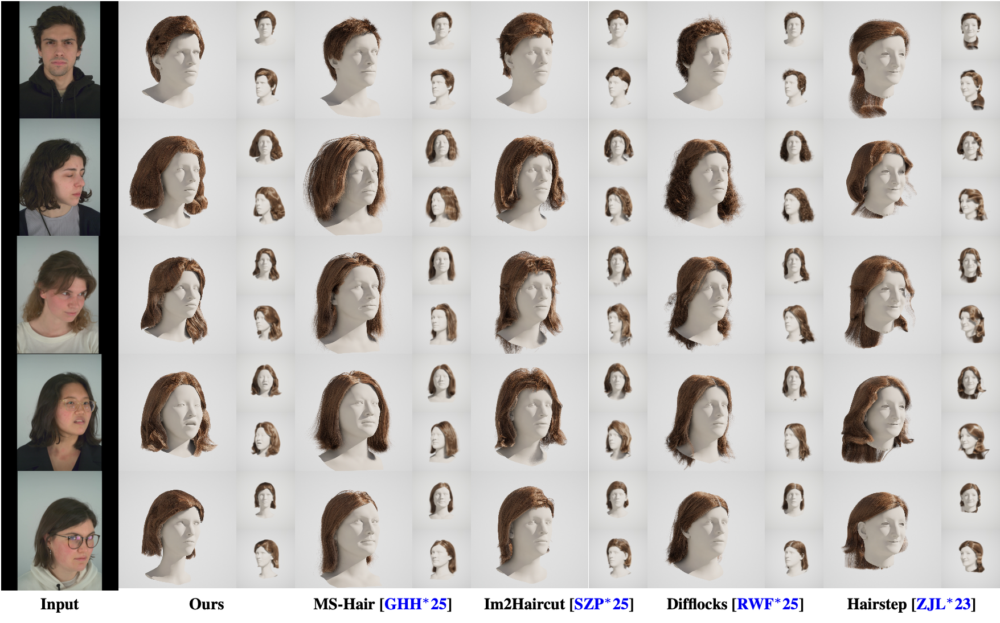

# Vid2Haircut

Official project page for:

👩 **Vid2Haircut: 3D Strand-Based Hairstyle Reconstruction from Video**  

Generating strand-based hairstyle from monocular video with head motion.

<p align="center">
  
</p>
Comparison with prior single-view and commercial baselines. Our method better preserves hairstyle-specific structure and improves consistency in side and partially occluded regions.

---

## Results

We provide reconstructed 3D hairstyles generated by our method.

👉 **Download examples:**  
[Download Results](https://drive.google.com/file/d/1w512W_saxS-6AxyZcJ7sEqc2M8aMWKfB/view?usp=sharing)


---

## Code

Example scripts are provided in the `scripts/` folder.

### Single-view initialization

```bash
./scripts/custom_static_1view.sh
```

### Multi-frame optimization

```bash
./scripts/custom_static_multi.sh
```

---

### Citation

Citation information will be added soon.


